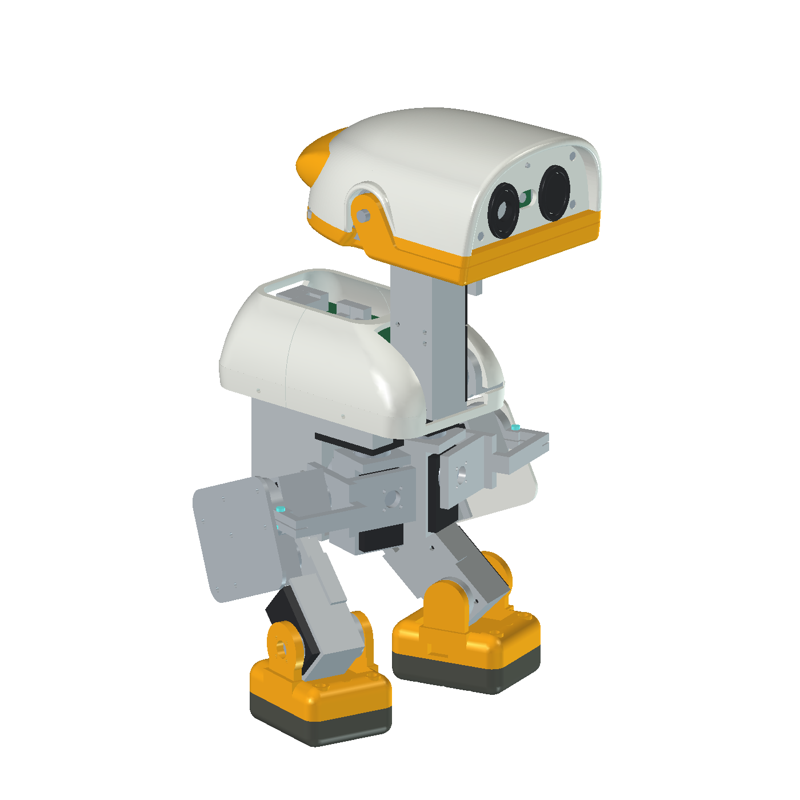

# IndieDuck by Armature AI Labs

A complete **R20 robot CAD study**, with the removable rear colour band integrated into the assembled robot. Adapted from Open Duck Mini and inspired by Pollen Robotics' MicroDuck, with reused XGO geometry identified in [THIRD_PARTY_NOTICES.md](THIRD_PARTY_NOTICES.md).

Armature's changes include compact joint supports, a two-eye face, local head-yaw clearance and a separately printable colour band. This repository contains the mechanical CAD only; runtime and reinforcement learning remain in [indieduck-runtime](https://github.com/armature-ai-labs/indieduck-runtime) and [indieduck-rl](https://github.com/armature-ai-labs/indieduck-rl).

## Open the robot

Download and extract the entire release ZIP, then open **`native/robot/IndieDuck_R20_Assembly.FCStd`** in FreeCAD 1.1.4. Keep these four sibling files together so relative links resolve:

| File | Purpose |
|---|---|
| `IndieDuck_R20_Assembly.FCStd` | Complete robot in its saved standing pose, including the mounted band |
| `IndieDuck_R20_Structure.FCStd` | Structural parts, covers, face, feet and retained construction history |
| `IndieDuck_R20_Interfaces.FCStd` | Joint carriers, clamps, retainers and hardware references |
| `IndieDuck_R20_HeadBand.FCStd` | Editable band profiles, attachment features and mounting-hole head shell |

Edit the source documents rather than presentation snapshots. Older feature names such as `R17_HeadPitch` remain stable identifiers inside R20; they do not indicate that an older assembly must be downloaded. Hidden construction objects are retained where they support editing and provenance. They are not additional parts to print.

The assembly's `YawMotion` spreadsheet accepts a plain number in cell B1, for example `-90`, `0` or `90`. This is a head-yaw study control, not a general pose editor or a guarantee of physical travel. Restore `0` for the default saved view.

## Files and colours

- `exports/`: matching R20 STEP and STL files for the 41 current printed-component candidates, plus the assembled STEP. Purchased servos, electronics, bearings and metal fasteners remain assembly references, not printed-component exports.
- `previews/`: actual assembled and inspection CAD views.
- `drawings/`: applicable review drawings. Inherited sheets retain their original revision labels; they are not a complete dimensioned manufacturing drawing set.
- [COMPONENTS.csv](COMPONENTS.csv) maps every current printed component; [MANIFEST.json](MANIFEST.json) and [SHA256SUMS](SHA256SUMS) identify the packaged files and their source objects. Keep native files and exports from the same release together.

Geometry uses **millimetres**. Individual exports retain their native CAD coordinates; they are not arranged on a build plate or sliced. Colour in the CAD is an appearance setting, not a material specification. Use PLA for initial rigid fit tests and TPU 95A for soles and lips. Bambu Studio can prepare printer-specific jobs after orientation, supports, nozzle and material profiles are checked.

Print the rear band separately in any desired colour. Multicolour printing is not required. The band covers the retained head reinforcement and is attached using two internal screws and captive nuts. Remove the head shell for screw access; the nuts load through the band's underside slots. It is tool-removable, not a snap-on accessory.

The **M2×10 screw with a nominal 0.5 mm washer** is a provisional stack, not a confirmed hardware specification. In the centre-line CAD stack it leaves about 0.492 mm screw-tip space; a bare 10 mm screw reaches the blind end. Confirm printed nut fit, screw length, head seating and tool access before tightening. The band is decorative, not a handle or impact bumper.

## Prototype limits

“Complete” means the current robot assembly and its current printed-component CAD are packaged together. CAD reopening, link checks, solid checks and export checks are distinct from physical fit, slicing, strength and motion tests. Read [VERIFICATION.md](VERIFICATION.md) for the exact checks performed on this release.

A band mesh/CAD volume discrepancy and a smaller assembled STEP volume discrepancy remain recorded in [VERIFICATION.md](VERIFICATION.md). Inherited neck-motion collisions remain unresolved. Combined head motion, cable routing, full band-removal travel, printed tolerances, bearing preload, fastener engagement and structural loads require further work. No trained walking, impact resistance or reproducible physical build is claimed by this release.

See [CONTRIBUTING.md](CONTRIBUTING.md) for changes. Source-specific attribution, applicable licences and unresolved redistribution terms are collected in [THIRD_PARTY_NOTICES.md](THIRD_PARTY_NOTICES.md); this mixed-source collection is not covered by a blanket Apache-2.0 grant.
